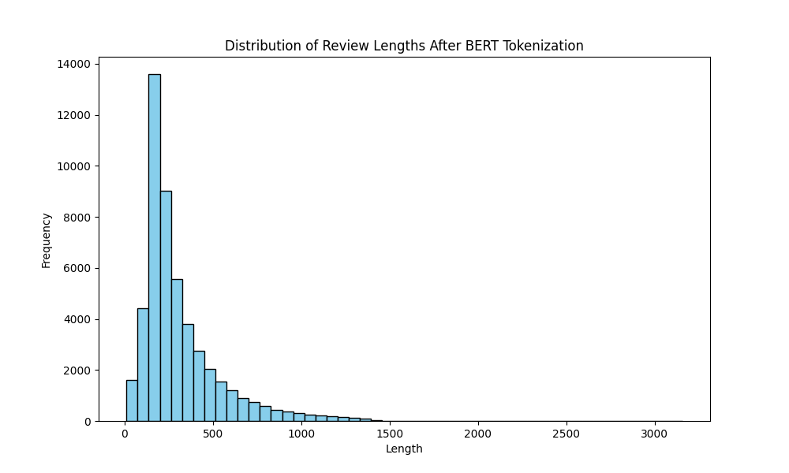

## 实验报告

### 代码说明

```
.
├── bert                      # bert 模型
├── configs.py                # 参数配置文件
├── data                      # 数据集
│   ├── csv2jsonl.py
│   ├── eval.jsonl
│   ├── IMDB_Dataset.csv
│   ├── IMDB.jsonl
│   ├── split_jsonl.py
│   ├── test.jsonl
│   └── train.jsonl
├── dataloader.py            # 数据加载类
├── length_distribution.png
├── model.py                 # 模型定义类
├── output                   # 模型存放路径
│   └── checkpoint1
├── README.md
├── statistics_token_length.py
├── test.py                  # 测试代码
├── train.py                 # 训练代码
└── 实践与作业-手册.pdf
```

### 数据集划分与统计

使用`data/IMDB_Dataset.csv`数据集，其中共有50000条数据。采用train:eval:test = 7:1:2的比例进行数据集划分

使用bert-base-uncased模型tokenizer对其进行分词，统计结果如下：



其中token length < 512 的数据占比85.5%，所以使用了预训练的bert-base-uncased模型代替Word2Vec模型进行向量嵌入。

同时对模型进行了修改，采用 `bert -> LSTM -> FC` 结构进行二分类任务训练。

在 `data` 目录中运行 `csv2jsonl.py` 文件可得到 `IMDB.jsonl` 文件，运行 `split_jsonl.py` 文件可将 `IMDB.jsonl` 文件按照比例划分为 `train.jsonl` 、`eval.jsonl` 和 `test.jsonl` 文件。

### 实验结果

超参数配置请见 `configs.py` 文件，模型的训练时信息如下：

```
-------------- start training --------------- 

========= Epoch: 0 ==============                                          
Average Loss: 49.289 %                                                     Accuracy: 0.925600 -- Precision: 0.927802 -- Recall: 0.924116 -- F1: 0.925955 -- AUC: 0.978435
保存模型参数
New max accuracy: 0.926                                                                                                   

========= Epoch: 1 ==============                                                                                         
Average Loss: 46.858 %                                                     Accuracy: 0.932400 -- Precision: 0.948169 -- Recall: 0.915773 -- F1: 0.931690 -- AUC: 0.981764
保存模型参数
New max accuracy: 0.932                                                                                                   

========= Epoch: 2 ==============                                                                                         
Average Loss: 46.075 %                                                     Accuracy: 0.924600 -- Precision: 0.952240 -- Recall: 0.895113 -- F1: 0.922793 -- AUC: 0.980246
No improvement: 1 epochs                                                                                                  

========= Epoch: 3 ==============                                                                                         
Average Loss: 45.709 %                                                                                             
Accuracy: 0.929200 -- Precision: 0.908885 -- Recall: 0.955105 -- F1: 0.931422 -- AUC: 0.980572
No improvement: 2 epochs                                                                                                  
Stopping early due to no improvement                                                                                      

+++++++++++++ Training Complete +++++++++++++
```

在epoch=1是达到最高accu，故采用此模型进行测试。
测试结果如下：

```
Accuracy: 0.930700 -- Precision: 0.948914 -- Recall: 0.911402 -- F1: 0.929780 -- AUC: 0.979127
```

